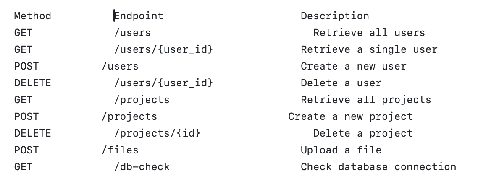
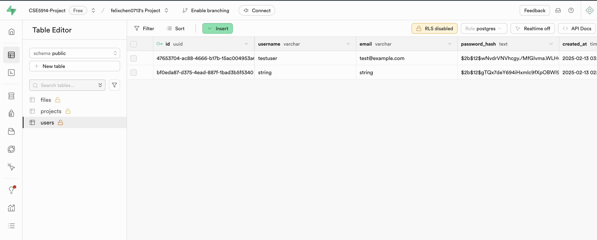
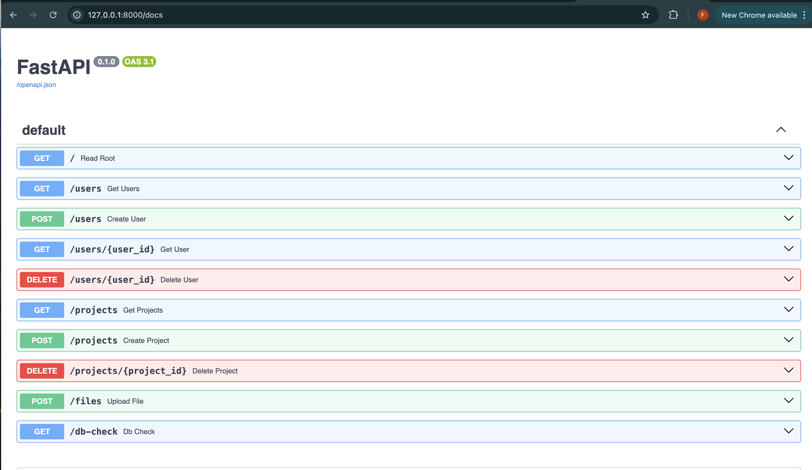
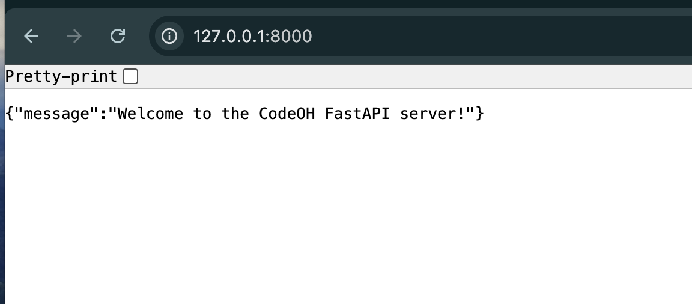
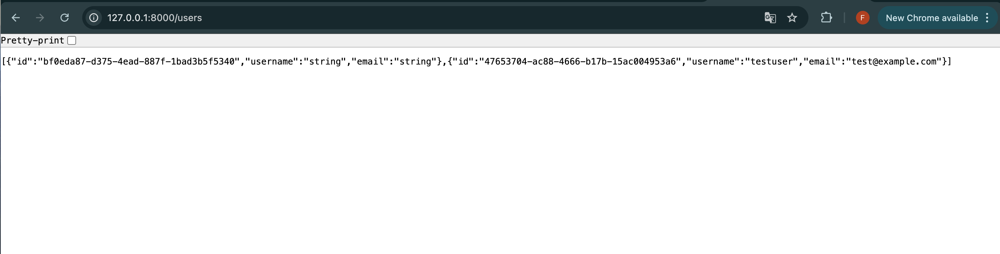

This is a FastAPI-based backend service for managing users, projects, and files. The project is connected to a PostgreSQL database and supports CRUD operations.

Features

🔹 User Management: Create, retrieve, and delete users with hashed passwords.

🔹 Project Management: Associate projects with users and manage them.

🔹 File Upload: Upload files linked to projects.

🔹 Database Connection Check: Verify the connection to the database.

Setup Instructions
1. Run the following command to install required Python packages:
pip install --user fastapi uvicorn sqlalchemy bcrypt psycopg2 pydantic

Note: Ensure that `pip` is correctly pointing to Python 3 before running the installation command. If unsure, use:
python3 -m pip install --user fastapi uvicorn sqlalchemy bcrypt psycopg2 pydantic

2. To run the FastAPI server:
uvicorn main:app --reload

Note: Ensure that `pip` is correctly pointing to Python 3 before running the installation command. If unsure, use:
python3 -m uvicorn main:app --reload

4. Then, open http://127.0.0.1:8000/docs to test APIs using Swagger UI.

5. Database Connection
Ensure your PostgreSQL database is properly configured in database.py before running the server.

## API Endpoints

Here are the available API endpoints:

## Example demo
Here is the demo of checking users variable in Supabase

Here is the demo of http://127.0.0.1:8000/docs

Here is the demo of http://127.0.0.1:8000

Here is the demo of http://127.0.0.1:8000/users

