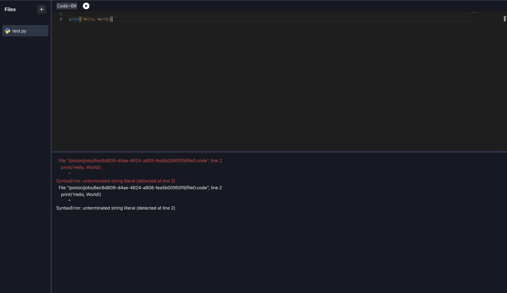
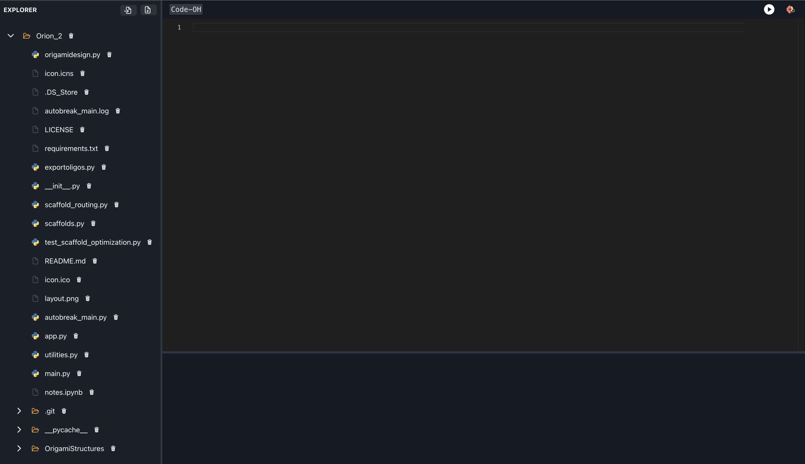
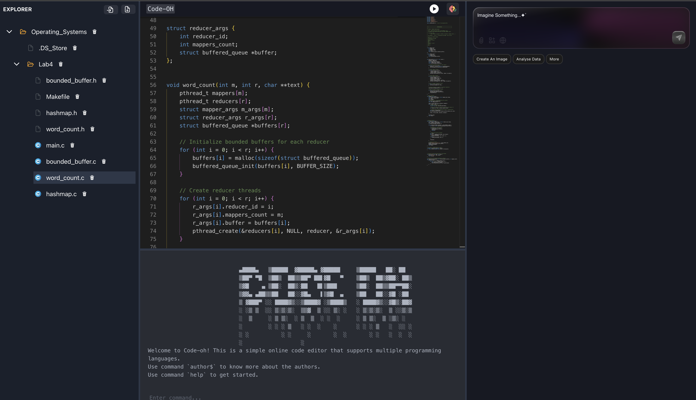
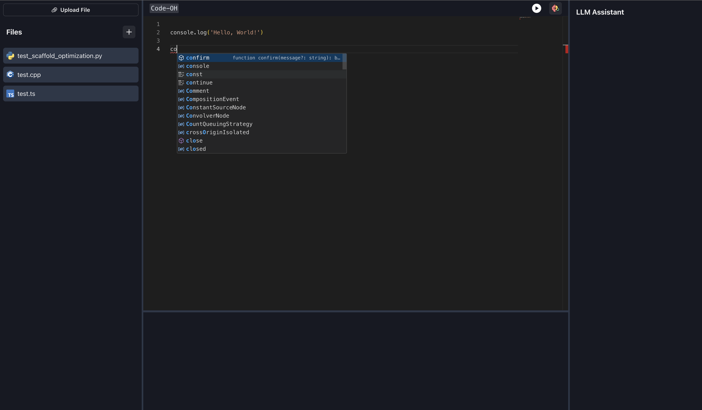

# CodeOH

A modern web-based code editor with integrated AI assistance.










## Features

- Multi-language support
- Integrated AI assistant
- Real-time code execution
- File management system
- Dark/Light mode support

## Prerequisites

- Node.js (v18 or higher)
- npm (v9 or higher)

## Installation

1. Install dependencies:

```bash


npm create vite@latest code_oh -- --template react

npm i @chakra-ui/react @emotion/react @emotion/styled frame

npm install @monaco-editor/react

npm install @chakra-ui/icons react-resizable-panels

npm install react-icons

npm install @fortawesome/react-fontawesome @fortawesome/free-brands-svg-icons @fortawesome/fontawesome-svg-core

npm install axios

npm install monaco-languageclient vscode-languageserver-protocol

npm install monaco-python monaco-java

npm install primereact primeicons

npm install primeflex --save

```

This will install all required dependencies including:

- Chakra UI for the interface
- Monaco Editor for code editing
- React Resizable Panels for layout
- Axios for API calls
- And other necessary packages

## Running the Project

To start the development server:

```bash
npm run dev
```
